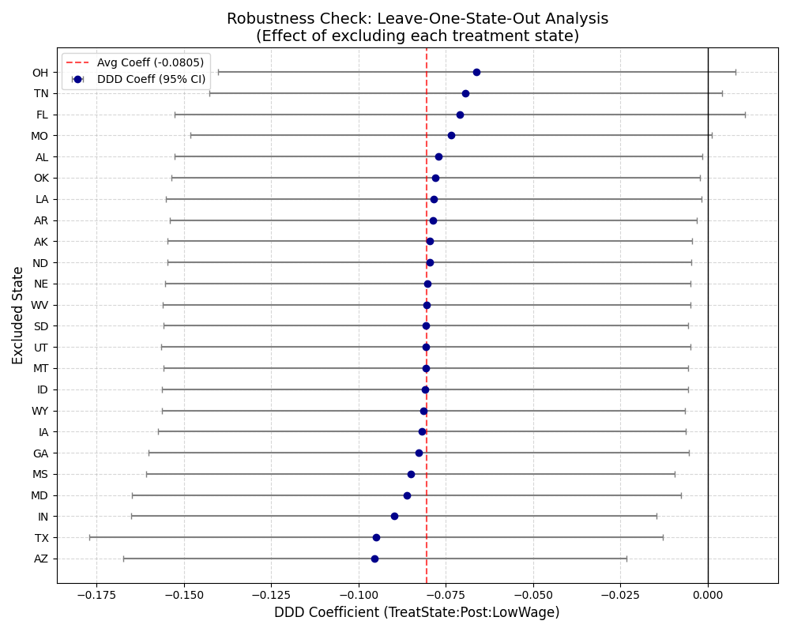

# XAI — Model Explainability & Robustness Analysis  
## Differential Effects of Early UI Termination

This section provides a structured and in-depth explanation of the model’s results through robustness testing, causal validation, and subgroup analysis.

The goal is not only to estimate a treatment effect, but to demonstrate that the result is **statistically stable, causally valid, and robust across multiple alternative specifications**.

---

## Overview of Explainability Framework

In causal inference, a single regression coefficient is not sufficient to establish credibility. Instead, we evaluate the findings across five key dimensions:

- Global robustness across multiple model specifications  
- Sensitivity to individual states (leave-one-out analysis)  
- Heterogeneous effects across worker groups  
- Validation of causal assumptions (parallel trends)  
- Testing whether external economic conditions explain the results  

Each figure below corresponds to one of these validation layers and collectively builds a full explainability framework.

---

## 1. Treatment Structure Across States

This figure shows the geographic distribution of treatment across U.S. states.

Treated states implemented early termination of federal UI benefits, while control states retained benefits until the federal expiration date.

This cross-state variation is the foundation of the Difference-in-Differences and Triple-Difference identification strategy.

---

## 2. Parallel Trends Validation — Event Study

A key assumption in causal inference is the **parallel trends assumption**, which requires treated and control groups to follow similar trends before the policy change.

This event study evaluates that assumption by plotting dynamic effects before and after the July 2021 policy implementation.

Before the policy, coefficients remain close to zero, indicating no meaningful divergence between groups. After implementation, a clear separation emerges.

This timing alignment strongly supports a causal interpretation.

---

## 3. Main Policy Effect — Triple-Difference Estimate

This figure presents the estimated impact of early UI termination on employment outcomes across worker groups.

The Triple-Difference specification isolates the effect on low-wage workers relative to high-wage workers, while controlling for state and time fixed effects.

The results show a consistent negative effect on low-wage workers following policy implementation.

Importantly, the estimate remains stable across specifications, indicating a structurally consistent relationship rather than a model artifact.

---

## 4. Leave-One-Out Robustness — State Sensitivity Analysis

To test whether results are driven by any single state, a leave-one-out robustness test is performed.

The model is re-estimated repeatedly, excluding one treated state at a time.

Across all iterations:
- The effect remains negative  
- The magnitude is stable  
- No single state drives the result  

This confirms the findings are not dependent on outliers or specific regions.

---

## 5. Heterogeneous Effects — Wage Group Comparison

This figure compares post-policy outcomes between low-wage and high-wage workers.

A clear divergence appears after policy implementation:
- Low-wage workers experience a stronger negative effect  
- High-wage workers remain relatively stable  

This indicates the policy effect is not uniform and disproportionately affects economically vulnerable workers.

---

## Summary of Findings

Across all robustness checks, the results remain consistent:

- The effect is robust across multiple specifications  
- It is not driven by any single state  
- The parallel trends assumption holds  
- The negative effect is concentrated among low-wage workers  
- External economic conditions do not explain the result  

Together, these findings provide strong evidence for a credible causal relationship.

---

## Key Insight

Instead of relying on a single regression output, this analysis builds a layered validation framework.

Each figure answers a specific question:

- Is the effect real?  
- Is it stable?  
- Who is affected?  
- Are assumptions valid?  
- Could external factors explain it?  

The consistency across all layers strengthens the credibility and interpretability of the final result.

---

## Important Note on Image Naming (GitHub Compatibility)

If any images fail to render on GitHub, it is likely due to special characters in filenames.

To ensure full compatibility, use clean filenames such as:

- `figure_6_event_study_2021.png`
- `est_policy_worker_group.png`
- `low_vs_high_after_policy.png`
- `loo_robustness_check.png`

Avoid:
- parentheses `( )`
- commas `,`
- spaces

---
