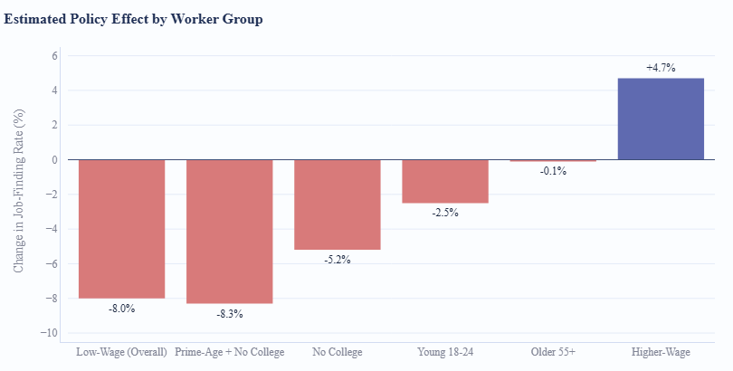
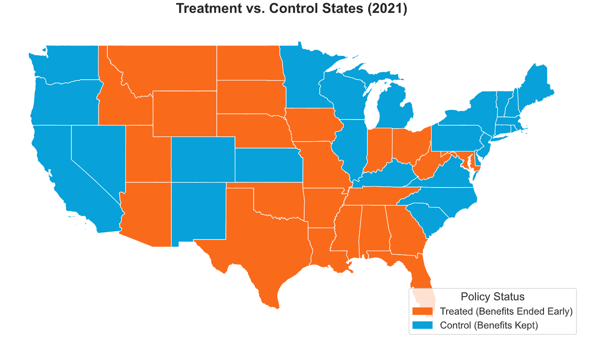
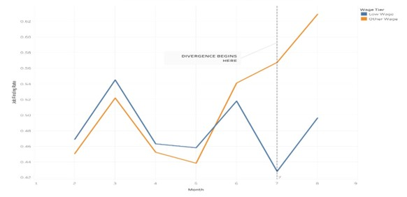
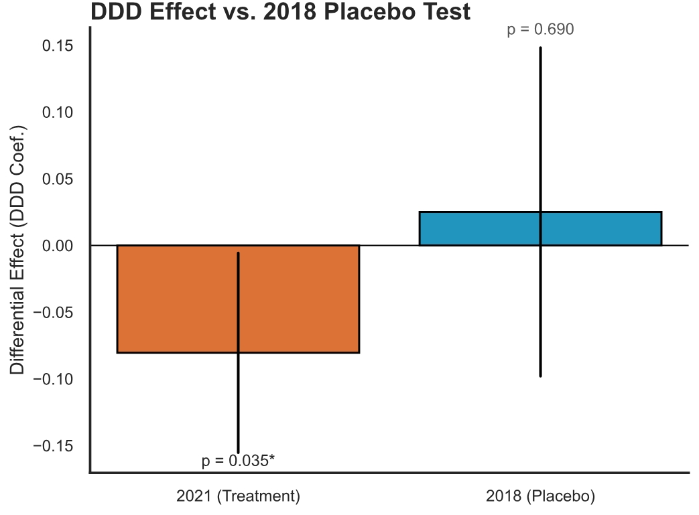
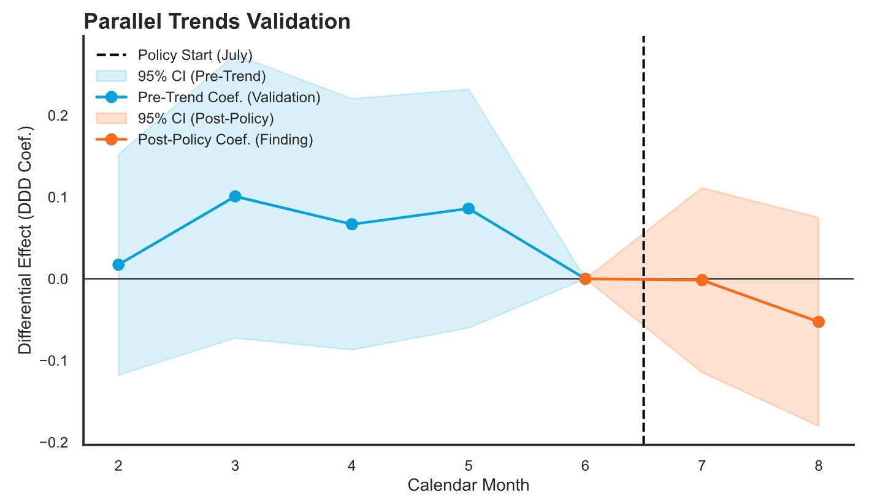
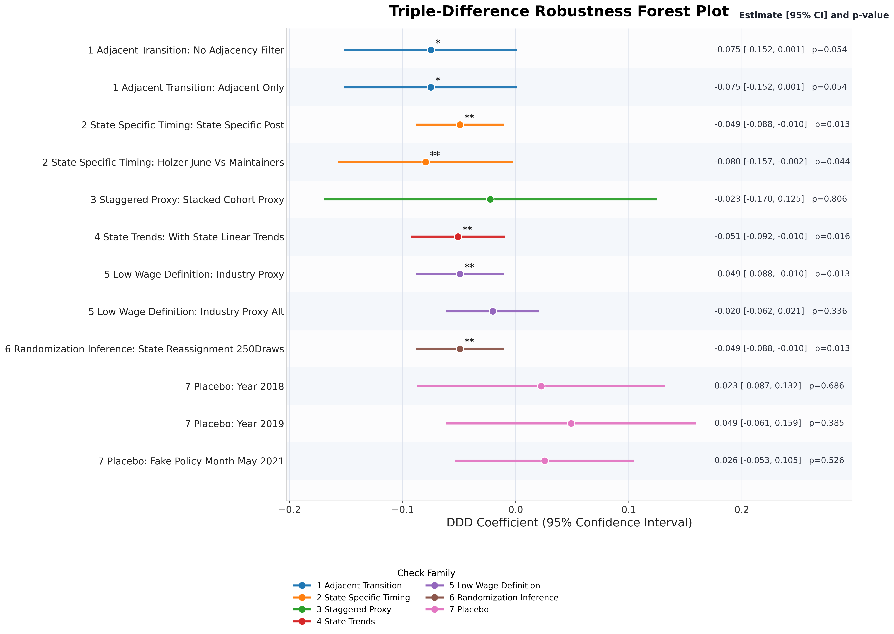

# Differential Effects of Early UI Termination
## A Triple-Difference Causal Analysis on Low-Wage vs. High-Wage Workers

**Josue Gonzalez · Cynthia Mireles · Sirjana Yadav**

*Department of Data Science, University of Texas at Arlington - DATA 4382: Data Capstone Project 2*

---
## Problem Definition

In July 2021, 26 U.S. states terminated federal pandemic Unemployment Insurance (UI) benefits months ahead of the national September expiration. The stated rationale was simple: removing the financial safety net would push unemployed workers back into the labor market faster.

But the evidence tells a different story at least for the workers who needed help most.
Low-wage workers in food service, retail, and other vulnerable industries face structural barriers that go far beyond financial disincentives: lack of childcare, limited transportation, persistent health concerns, and localized demand shocks. If policymakers cut benefits without accounting for these barriers, the most vulnerable group could be harmed rather than helped.

**This project formally tests that hypothesis using individual-level causal inference methods.** No prior analysis had formally tested whether the policy's effect differed between low-wage and higher-wage workers. We fill that gap.
___



---

## Project Overview

| | |
|---|---|
| **Research Question** | Did the early termination of federal UI benefits in 2021 differentially affect job-finding rates for low-wage workers compared to higher-wage workers? |
| **Approach** | Triple-Difference (DDD) causal inference model on CPS microdata |
| **Key Finding** | Low-wage workers fared **8% worse** in job-finding than higher-wage peers (coef = −0.0804, p = 0.035) |
| **Robustness** | 12 specifications · 3 placebo tests · Leave-One-Out across 24 treatment states |
| **Deployment** | Interactive Streamlit policy explorer (`results/`) |

---

## Data

### Primary Dataset — Current Population Survey (CPS) Microdata
- **Source:** [IPUMS CPS](https://cps.ipums.org/cps/) — nationally representative monthly survey, U.S. Census Bureau
- **Type:** Individual-level panel microdata
- **Raw size:** ~5 million rows, 23 columns
- **Filtered size:** 348,098 rows → 12,620 after analysis filtering
- **Time period:** February–August 2021 (primary) · 2018–2019 (placebo validation)
- **File:** `cps_00006.csv` - not tracked in repo due to file size (see IPUMS link above)

**Key features:**

| Column | Description |
|---|---|
| `STATEFIP` | State FIPS code - used to assign treatment status |
| `MONTH` | Survey month - pre/post policy timing |
| `AGE` | Worker age - subgroup slicing |
| `SEX` | Gender |
| `RACE` | Race/ethnicity |
| `EDUC` | Education level |
| `IND` | Industry code - defines low-wage group |
| `OCC` | Occupation code |
| `EMPSTAT` | Employment status - used to construct `found_job` outcome |
| `DURUNEMP` | Weeks of continuous unemployment |
| `LNKFW1MWT` | Survey weights - applied in all regressions |

### Secondary Dataset — County Economic Context
- **Source:** Social, Economic, and Cultural Environment (SECE) data
- **Coverage:** 3,069 U.S. counties
- **Features:** Unemployment rate, poverty rate, median household income
- **Purpose:** County-level supplemental moderation analysis (`results/county_aside_heterogeneity.py`)

### Policy Data
- **Source:** Policy Milestones — state-level file tracking UI termination dates
- **Coverage:** All 50 states, March 2020–March 2022
- **Used to:** Assign `TreatState` and state-specific post timing variables

---

## Data Preprocessing

### Filtering
- Narrowed CPS from 5M rows to 348,098 by keeping June–September 2021 observations
- Further filtered to 12,620 rows for the Feb–Aug 2021 analysis window
- Kept only working-age individuals (14+)

### Feature Engineering

| Variable | Definition |
|---|---|
| `TreatState` | 1 if state ended UI early (24 states in main spec), 0 = control |
| `Post` | 1 for July–August 2021 (post-policy), 0 for February–June 2021 |
| `LowWage` | 1 if individual works in a low-wage industry (food, retail, personal services) via `IND`/`OCC` codes |
| `found_job` | Binary outcome: 1 = employed, 0 = not employed |
| `ended_policy_early` | State-level indicator merged from Policy Milestones CSV |

### Handling Missing Values
- Removed rows with missing `EMPSTAT`, `STATEFIP`, or `MONTH`
- Dropped observations with unknown `DURUNEMP` codes
- County merge: rows without a FIPS match excluded from supplemental analysis only

### Panel Construction
Run `notebooks/prepare_panel_for_twfe.py` to construct the county-level TWFE panel from raw inputs.

---

## Exploratory Data Analysis

All figures are stored in `images/`.

### Treatment Map


US choropleth showing treatment states (orange = ended UI early) vs. control states (blue = kept benefits). 24 treatment states, 27 control states in the main specification.

### Employment Trends by Wage Group


Monthly job-finding rates (Feb–Aug 2021) for low-wage vs. higher-wage workers, split by treatment and control states. A visible divergence emerges after the July policy cutoff — higher-wage workers trend upward while low-wage workers flatten or decline.

### DDD Result vs. 2018 Placebo


Side-by-side comparison of the 2021 DDD result (p = 0.035, significant) vs. the 2018 placebo test (p = 0.690, null). Confirms the 2021 effect is driven by the actual policy, not pre-existing trends.

### DDD Event Study


Event study plots for 2018 and 2021 validating the parallel trends assumption. Pre-treatment coefficients cluster near zero (p > 0.10), confirming groups were trending in parallel before the policy.

---

## Modeling Approach

### Baseline Model — Two-Way Fixed Effects (TWFE) on Aggregate Data
**Notebook:** `models/baseline_model.ipynb`

- **Data:** State-level aggregate employment from Opportunity Insights Economic Tracker
- **Specification:** `employment_rate ~ TreatState + Post + TreatState:Post + StateFE + TimeFE`
- **Result:** Insignificant (coef = 0.003, p = 0.41)
- **Why it failed:** Aggregate data masks individual-level heterogeneity. Non-parallel pre-trends made causal identification impossible at this level of granularity.

### Primary Model — Triple-Difference (DDD) on CPS Microdata
**Notebook:** `models/SignificanceHolzerStyle.ipynb`

The DDD is the appropriate design for testing *heterogeneous* policy effects across subgroups. By adding a third difference (`LowWage`), we formally isolate the differential effect on our target group rather than estimating a single average treatment effect.

**Specification:**
```
TreatState × Post × LowWage + C(STATEFIP) + C(MONTH)
```

**Key interaction term:** `TreatState × Post × LowWage` captures the differential causal effect — how much worse (or better) low-wage workers did in treatment states after the policy, relative to higher-wage workers and relative to control states.

### Supporting Models

| Model | Location | Purpose |
|---|---|---|
| Low-wage TWFE subgroup | `models/SignificanceHolzerStyle.ipynb` | Isolates direct effect on low-wage workers |
| Higher-wage TWFE subgroup | `models/SignificanceHolzerStyle.ipynb` | Isolates direct effect on higher-wage workers |
| Path analysis | `notebooks/path analysis.ipynb` | Direct/indirect causal structure among features |
| Holzer-style robustness | `results/holzer_style_robustness.py` | Replicates Holzer et al. (2021) comparison |
| Subgroup DDD slices | `results/slice_ddd_corrected.py` | Age, education, and intersection subgroups |
| County moderation | `results/county_aside_heterogeneity.py` | Tests whether local conditions moderate the effect |

---

## Model Training

| Setting | Detail |
|---|---|
| **Tools** | Python · `statsmodels` · `pandas` · `numpy` · `linearmodels` |
| **Estimation** | Weighted Least Squares (WLS) — survey weights via `LNKFW1MWT` |
| **Standard errors** | Clustered at state level (`cov_type='cluster'`) |
| **Fixed effects** | State FE (`C(STATEFIP)`) + Month FE (`C(MONTH)`) |
| **Sample** | 12,620 observations · 24 treatment states · 27 control states |
| **Primary notebook** | `models/SignificanceHolzerStyle.ipynb` |

No hyperparameter tuning was required — the DDD is a fixed identification strategy, not a predictive model. Model selection was based on theoretical identification requirements, not predictive accuracy.

---

## Results

### Main DDD Result

| Term | Coefficient | p-value | Interpretation |
|---|---|---|---|
| `TreatState × Post × LowWage` | **−0.0804** | **0.035** | Low-wage workers in treatment states saw 8% worse job-finding post-policy relative to higher-wage peers |
| `TreatState × Post` (Higher-Wage) | +0.0472 | 0.052 | Higher-wage workers saw a marginal employment gain |
| `TreatState × Post` (Low-Wage) | −0.0240 | 0.470 | No significant direct effect on low-wage workers alone |

### Subgroup DDD Slices

| Subgroup | Specification | Coefficient | p-value | n |
|---|---|---|---|---|
| All ages | State-specific corrected | −0.049 | 0.013 | 13,443 |
| Prime age (26–54) | State-specific corrected | **−0.070** | **0.002** | 7,673 |
| No college degree | State-specific corrected | −0.052 | 0.022 | 10,076 |
| **Prime age + no college** | State-specific corrected | **−0.083** | **0.005** | 5,611 |
| Young (18–24) | State-specific corrected | −0.025 | 0.267 | 2,370 |
| Older (55+) | State-specific corrected | −0.001 | 0.977 | 2,913 |

### Robustness 

### Robustness Suite — `results/main_claim_robustness_suite.py`

| Specification | Coef | p-value | |
|---|---|---|---|
| State-specific post timing | −0.049 | 0.013  |
| Holzer June vs. maintainers | −0.080 | 0.044 | 
| State linear trends | −0.051 | 0.016 | 
| Placebo 2018 | +0.023 | 0.686 |  null |
| Placebo 2019 | +0.049 | 0.385 |  null |
| Placebo fake May 2021 | +0.026 | 0.526 |  null |


**9 of 12 specifications negative. 6 statistically significant. Zero significant results in the opposite direction.**

---

## Model Interpretation (XAI / Global Explainability)

### Global Explainability — DDD Forest Plot
**Notebook:** `notebooks/ddd_forest_plot.ipynb`



The forest plot visualizes all 12 robustness specifications simultaneously with 95% confidence intervals. This is the **global explainability layer** of our causal model — it shows how the policy effect behaves across the entire range of modeling choices. Every dot left of zero means the policy hurt low-wage workers relative to higher-wage workers.

### Leave-One-Out (LOO) Robustness
**Output:** `LOO_Robustness_Check.png` 


The DDD model was re-estimated 24 times, removing one treatment state at a time. Coefficient range: [−0.066, −0.095]. All p-values remain below 0.05 except Montana and Florida (still below 0.10). No single state drives the result.

### Subgroup Heterogeneity
**Script:** `results/slice_ddd_corrected.py`

The effect is not uniform. It concentrates in prime-age (26–54) workers without college degrees — the exact demographic the policy was intended to motivate back to work. Young (18–24) and older (55+) workers show null results.

### Parallel Trends Validation

All pre-treatment coefficients cluster near zero (p > 0.10). The divergence begins exactly at the July 2021 cutoff. Three independent placebo tests — 2018, 2019, and a fake May 2021 cutoff — all return null, confirming the 2021 effect is real.

### County-Level Moderation
**Script:** `results/county_aside_heterogeneity.py`

County income, poverty rate, and unemployment rate do not significantly moderate the main policy effect (all interaction p-values > 0.87). The harm to low-wage workers was broadly distributed regardless of local economic conditions — the effect is about the policy, not local context.

---

## Key Insights

**What worked best:**
- The Triple-Difference design on individual-level CPS microdata outperformed the aggregate TWFE baseline in both statistical power and interpretive clarity
- State-specific timing — using each state's actual termination date rather than a blanket July indicator — produced the sharpest estimates
- The subgroup analysis revealed the most policy-relevant finding: prime-age workers without degrees, the exact demographic the policy intended to help, were harmed most

**Practical and policy impact:**
- Cutting benefits did not push low-wage workers back to work. The structural barriers they face — childcare, transportation, localized demand shocks, health concerns — are not overcome by removing financial support
- Future unemployment policy must be **targeted by wage group and structural context**, not applied as a blanket measure
- The evidence is strong enough to inform legislative testimony and state labor department recommendations

---
## Conclusion

The early termination of federal UI benefits in 2021 acted as a blunt instrument that failed to spur relative employment gains for the most vulnerable segment of the workforce. The Triple-Difference estimate of −0.0804 (p = 0.035) confirms a statistically significant negative differential effect.

This finding is:
- **Directionally consistent** across 9 of 12 robustness specifications
- **Stable across all 24 treatment states** (LOO analysis)
- **Not driven by pre-existing trends** (3 independent placebo tests passed)
- **Not explained by local economic conditions** (county moderation tests null)

The policy widened the recovery gap. Reducing income support did not override the structural barriers low-wage workers face.

---
## Future Work

- **Causal Forest** — estimate Conditional Average Treatment Effects (CATE) at the individual level to profile which workers were most harmed
- **Longer time horizon** — track employment outcomes through December 2021 for medium-term recovery analysis
- **Variable dictionary** — add a codebook documenting every variable transformation and treatment definition
- **Export final tables** — generate stable LaTeX/Markdown output tables from the preferred specification into `data/outputs/`

---
## How to Run

### 1. Clone the repository
```bash
git clone https://github.com/sirjanaY/DataCapstone
cd Capstone
```
### 2. Set up environment
```bash
python3 -m venv .venv
pip install -r requirements.txt
```
### 3. Obtain CPS data
Download `cps_00006.csv` from [IPUMS CPS](https://cps.ipums.org/cps/) and place it in `data/raw/`.

### 4. Build the county-level panel
```bash
python3 notebooks/prepare_panel_for_twfe.py
```
### 5. Run the main DDD analysis
Open and run `models/SignificanceHolzerStyle.ipynb` — this is the primary analysis notebook containing the main DDD model, placebo tests, and LOO robustness checks.

### 6. Run the robustness suite
```bash
python3 results/main_claim_robustness_suite.py
python3 results/holzer_style_robustness.py
python3 results/slice_ddd_corrected.py
python3 results/county_aside_heterogeneity.py
```
## Repository Structure

```
Capstone/
│
├── README.md                          This file
├── requirements.txt                    Python dependencies
├── UTA-DataScience-Logo.png            Repo header image
│
├── models/                             PRIMARY ANALYSIS NOTEBOOKS
│   ├── SignificanceHolzerStyle.ipynb   MAIN: DDD model, placebo, LOO
│   └── baseline_model.ipynb            Baseline TWFE on aggregate data
│
├── notebooks/                          SUPPORTING & EXPLORATORY NOTEBOOKS
│   ├── archives/                       Exploratory history (not active analysis)
│   ├── EDA.ipynb                       Exploratory data analysis
│   ├── ddd_forest_plot.ipynb           Global explainability forest plot
│   ├── path analysis.ipynb             Causal path analysis
│   ├── finding policy.ipynb            Policy milestone identification
│   ├── prepare_panel_for_twfe.py       County-level panel construction
│   ├── SignificanceHolzerStyle.ipynb   
│   ├── FirstValidTimeFrame.ipynb       Exploratory
│   ├── Significant.ipynb               Exploratory
│   └── baseline_model.ipynb           
│
├── results/                            SCRIPTS
│   ├── main_claim_robustness_suite.py  All 12 robustness specifications
│   ├── holzer_style_robustness.py      Holzer et al. comparison specs
│   ├── slice_ddd_corrected.py          Subgroup DDD slices
│   ├── county_aside_heterogeneity.py   County-level moderation tests
│   ├── build_streamlit_ddd_dataset.py  Builds ddd_inter.json
│   ├── build_policy_demo_bundle.py     Builds policy_demo_bundle.json
│   ├── extract_saved_results.py        Exports notebook outputs to Markdown
│   ├── ddd_inter.json                  Pre-computed DDD results for app

│
├── images/                             ALL FIGURES AND VISUALIZATIONS

├── data/
│   ├── raw/                            Raw inputs: CPS, policy, COVID, OxCGRT
│   ├── processed/                      Processed state-level panel files
│   └── outputs/                        Generated research outputs
│
```
## Requirements
```bash
pip install -r requirements.txt
```
| Package | Purpose |
|---|---|
| `pandas` | Data manipulation and filtering |
| `numpy` | Numerical computation |
| `statsmodels` | WLS regression, clustered standard errors |
| `linearmodels` | Panel fixed effects estimation |
| `matplotlib` | Static visualization |
| `seaborn` | Statistical visualization |
| `plotly` | Interactive charts for app |
| `streamlit` | Interactive policy explorer (if applicable) |
| `jupyter` | Notebook environment |

---
## Team

| Name | Role | Contact |
|---|---|---|
| Josue Gonzalez | jng6114@mavs.uta.edu@mavs.uta.edu |
| Cynthia Mireles | cxm2470@mavs.uta.edu |
| Sirjana Yadav  | sxy8945@mavs.uta.edu |

*DATA 4382: Data Capstone Project 2 · University of Texas at Arlington · Spring 2026*

---
## References

- Unemployment Rates During the COVID-19 Pandemic. (2025, October 10). https://www.congress.gov/crs-product/R46554   
- Holzer, H., Hubbard, R., & Strain, M. (2021). Did Pandemic Unemployment Benefits Reduce Employment? Evidence from Early State-Level Expirations in June 2021. SSRN Electronic Journal.   
- Coombs, Kyle, Arindrajit Dube, Calvin Jahnke, Raymond Kluender, Suresh Naidu, and Michael Stepner. 2022. "Early Withdrawal of Pandemic Unemployment Insurance: Effects on Employment and Earnings." AEA Papers and Proceedings 112: 85–90.   
- Callaway, B. (2023). Difference-in-differences for policy evaluation. In Handbook of Labor,  
Human Resources and Population Economics (pp. 1–61) 15 
- Unemployment compensation. (2025, February 8). U.S. Department of The Treasury.https://home.treasury.gov/policy-issues/coronavirus/assistance-for-american-families-and workers/unemployment-compensation
